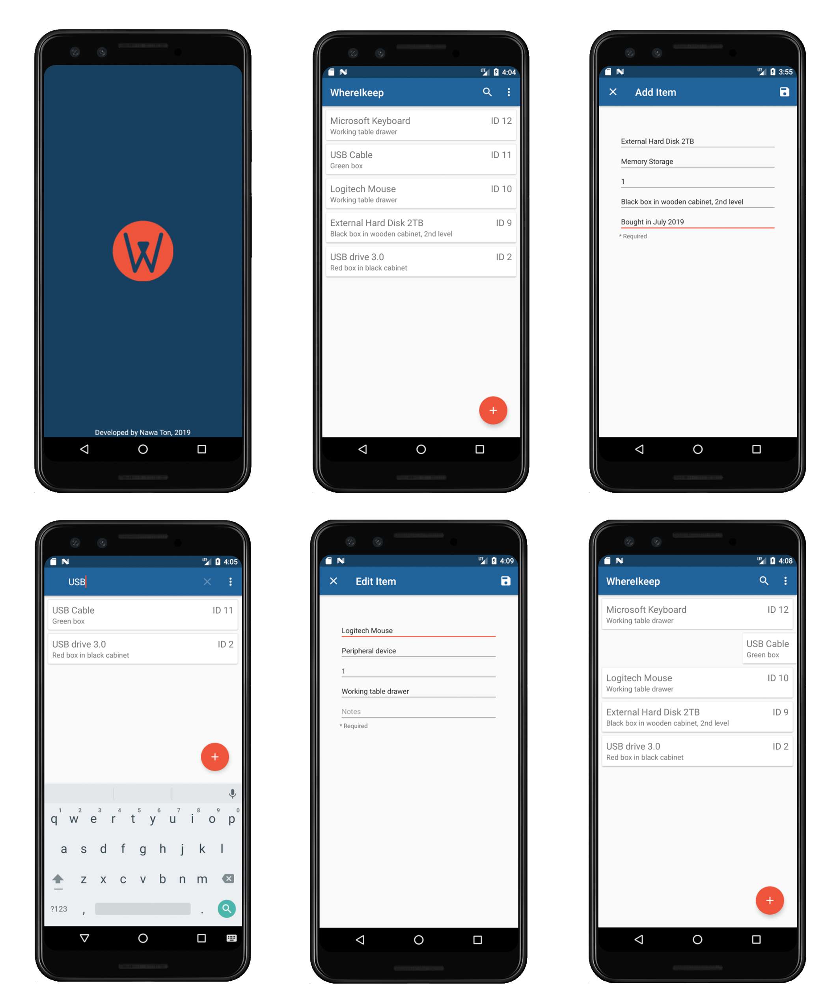

# WhereIKeep
WhereIKeep is an Android database application built with Java.
  
The app provides basic CRUD functions which allow users to modifying, searching and viewing their records.
  
Users can use this app to keep record and information about their belongings, such as quantity and storage location.
 

